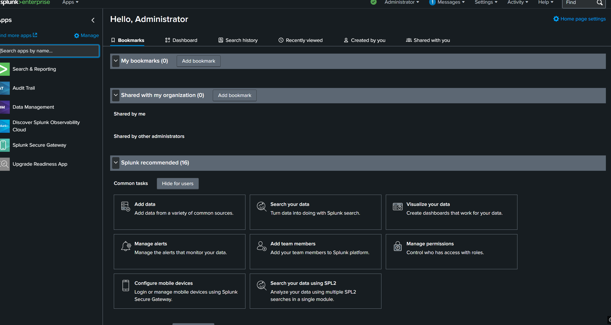
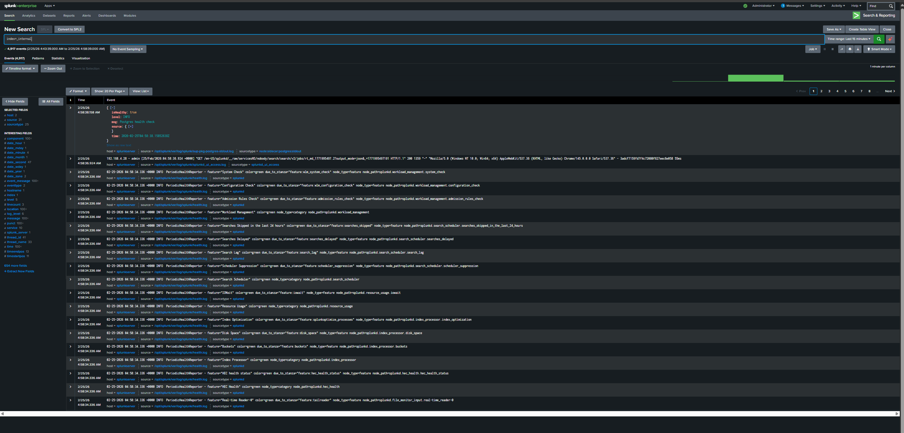
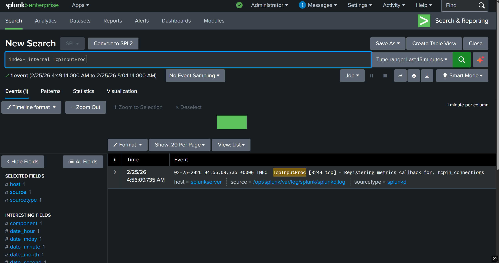
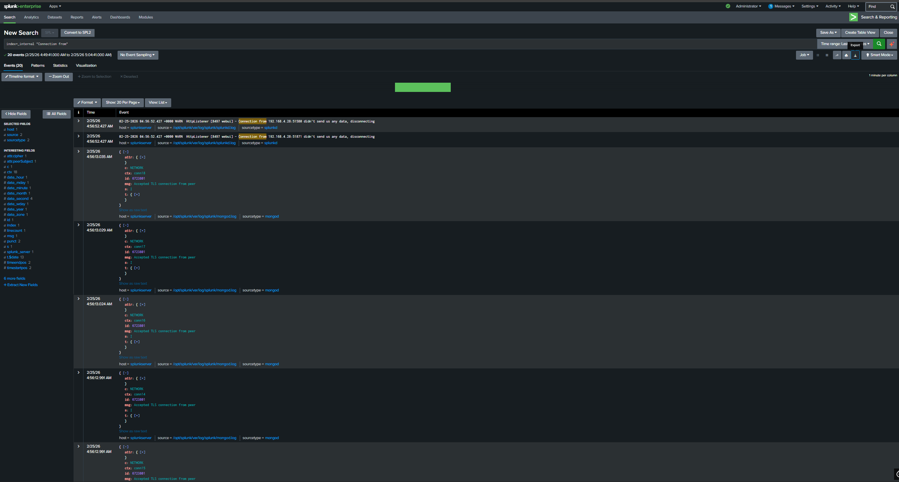
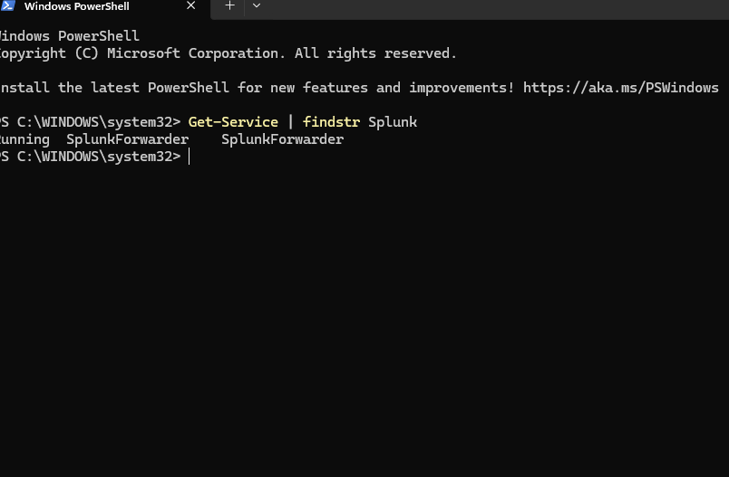
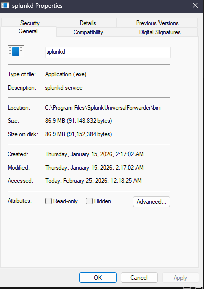

# Splunk SIEM Lab

## Project Overview

Built a functional Splunk SIEM lab using Windows and Linux virtual machines. Configured log forwarding from a Windows endpoint to a Splunk Enterprise server. Validated log ingestion using internal index searches and TCP connection verification.

## Lab Architecture

- Splunk Enterprise Server on Linux VM
- Windows 10 Endpoint with Universal Forwarder
- TCP log forwarding
- Internal index ingestion validation

## Configuration Steps

1. Installed Splunk Enterprise on Linux VM
2. Installed Splunk Universal Forwarder on Windows VM
3. Configured forwarder to send logs to Splunk server
4. Verified SplunkForwarder service running
5. Validated ingestion using:
   - index=_internal
   - index=_internal TcpInputProc
   - index=_internal "Connection from"

## Ingestion Validation

### Splunk Web Dashboard

### Internal Index Search

### TcpInputProc Verification

### Connection Validation

### Forwarder Service Running

### Forwarder Install Path

## Skills Demonstrated

- SIEM deployment
- Log forwarding configuration
- Splunk search and ingestion validation
- Windows service management
- Linux log monitoring
- TCP connection analysis
- VMware virtual machine administration
